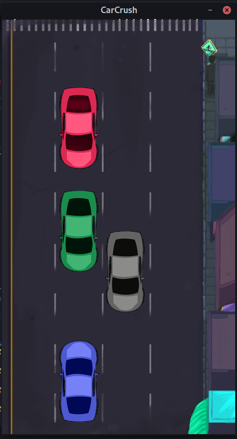

# CarCrush
A simple game using SDL2

  

## Build
You need `SDL2` and `SDL2-Image` instaled, then:

    make

## Run 
Simple run:

    make run

## Disclaimer
I make this game to test [my simple neural network in cpp](https://github.com/Krymancer/neural-networks/blob/master/simple-neural-network/CPP/Makefile)